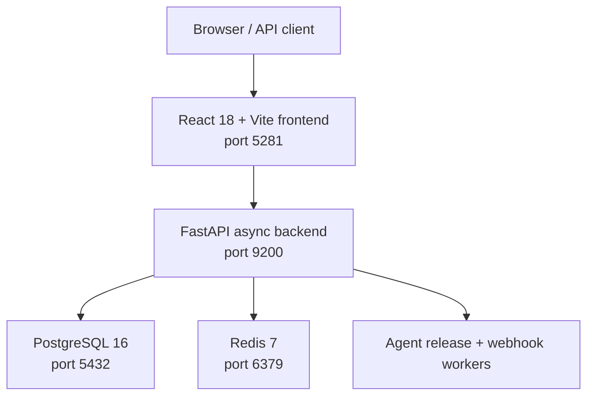

# Clinical Trial Management System


A full-stack Clinical Trial Management System (CTMS) for managing studies, sites, subjects, visits, investigational product accountability, adverse event reporting, regulatory submissions, and real-time agent-driven monitoring.

This repository is part of the **Symphonix Health** ecosystem and follows the sibling-repo conventions for service ports, design system integration, and CAID-driven verification.

## Architecture



The backend is built with FastAPI 0.111, SQLAlchemy 2.0 async, Pydantic v2, and pytest with 100% statement coverage. The frontend is built with React 18, Vite 5, TypeScript, React Router, and axios, styled with the Symphonix Health design system.

## Quickstart

### Local development

Clone the repository, then start the full stack with Docker Compose:

```bash
cd clinical-trial-system
docker compose up --build
```

This boots PostgreSQL, Redis, the backend (`http://localhost:9200`), and the frontend (`http://localhost:5281`).

### Backend only

```bash
cd backend
python -m venv .venv
source .venv/bin/activate  # Windows: .venv\Scripts\activate
pip install -e ".[dev]"
pytest --cov=app --cov-fail-under=100
uvicorn app.main:app --host 0.0.0.0 --port 9200 --reload
```

### Frontend only

```bash
cd frontend
npm install
npm run dev
```

## API surface

| Domain | Prefix | Key operations |
|--------|--------|----------------|
| Health | `/api/v1/health` | Readiness + liveness |
| Reference data | `/api/v1/reference` | Countries, indications, phases |
| Studies | `/api/v1/studies` | CRUD, status lifecycle |
| Sites | `/api/v1/sites` | Site activation, capacity |
| Subjects | `/api/v1/subjects` | Enrollment, withdrawal, consent |
| Visits | `/api/v1/visits` | Scheduling, windows, protocol deviations |
| Adverse events | `/api/v1/adverse-events` | SAE capture, regulatory reporting |
| Investigational product | `/api/v1/ip` | Accountability, expiry, reconciliation |
| Regulatory | `/api/v1/regulatory` | Submissions, authority lists |
| Queries | `/api/v1/queries` | Data clarification, closure |
| Budgets | `/api/v1/budgets` | Forecasts, milestones |
| Reports | `/api/v1/reports` | eTMF, recruitment, expiry |
| Agents | `/api/v1/agents` | Release gate, worker status |
| Webhooks | `/api/v1/webhooks` | Signed inbound events |

Interactive OpenAPI docs are available at `http://localhost:9200/docs` when the backend is running.

## Environment variables

| Variable | Default | Purpose |
|----------|---------|---------|
| `CTMS_BACKEND_PORT` | `9200` | Backend host/container port |
| `CTMS_FRONTEND_PORT` | `5281` | Frontend host port |
| `DATABASE_URL` | SQLite (`sqlite+aiosqlite:///./ctms.db`) | Async database URL |
| `REDIS_URL` | `redis://localhost:6379/0` | Redis for caching/agent state |
| `WEBHOOK_SECRET` | *(dev-only)* | HMAC secret for webhook validation |
| `LOG_LEVEL` | `info` | Application log level |

For Docker Compose, `DATABASE_URL` is wired to the bundled PostgreSQL service.

## Ports

This repository is registered in the workspace port registry:

- **Backend:** `9200`
- **Frontend:** `5281`
- **PostgreSQL:** `5432` (shared infra)
- **Redis:** `6379` (shared infra)

## CI

GitHub Actions runs on every push and pull request:

- `ruff` linting
- `mypy` type checking
- `pytest` with `--cov-fail-under=100`

## Recent enhancements

- **100% backend coverage:** Added targeted tests for remaining branches in endpoints, CRUD helpers, agents, reports, and webhooks; raised CI gate to `--cov-fail-under=100`.
- **Symphonix Health design system adoption:** Migrated frontend to the shared design-system submodule and fixed the CAID app-harness coverage gate.

## License

MIT
